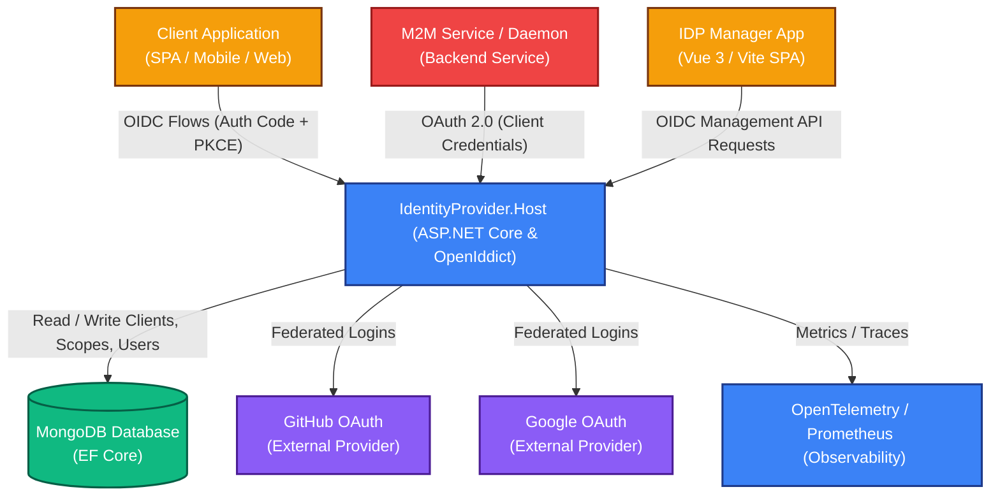

# ApogeeDev Identity Provider

[](https://dotnet.microsoft.com/)
[](https://vuejs.org/)
[](https://vitejs.dev/)
[](https://www.mongodb.com/)
[](https://github.com/openiddict/openiddict-core)
[](LICENSE)

An enterprise-ready, high-performance, and standards-compliant **OpenID Connect (OIDC) & OAuth 2.0 Identity Provider (IdP)**. Built using the robust **OpenIddict** framework on **ASP.NET Core**, backed by a production-tuned **MongoDB** datastore, and powered by an administrative **Vue 3 Management SPA** (`idp-manager-app`).

---

## 🏗️ System Architecture

The following diagram illustrates the relationship between client applications, the Identity Provider (IdP) core backend host, the MongoDB database, administrative tools, federated external authentication systems, and observability platforms.



---

## ✨ Key Features

- **Standardized OIDC & OAuth 2.0 Engine**: Built on top of **OpenIddict**, supporting modern security profiles, including **Authorization Code Flow with PKCE**, **Client Credentials (M2M)**, and **Refresh Tokens**.
- **Decoupled CQRS Architecture**: Structured using the **MediatR** pattern in .NET to decouple business rules and handler operations (`RequestHandlers` and `Processors`).
- **MongoDB Data Layer**: High-speed, document-driven persistence via `MongoDB.Driver` & `MongoDB.EntityFrameworkCore`. Specifically performance-tuned with automated database indexing initialization.
- **Federated Social Identity**: Seamlessly integrates external OAuth web identity providers (such as **Google** and **GitHub**) via unified custom Claims Processors.
- **Vue 3 Admin Dashboard**: A clean, responsive administrative interface built using **Vue 3 (Composition API with `<script setup>`)**, **Vite**, **Pinia** for state management, **Bootstrap 5**, and `oidc-client-ts` for OIDC-based API authentication.
- **Enterprise-Grade Observability**: Full metric and trace instrumentation using **OpenTelemetry** exported to **OTLP** and **Prometheus** endpoints, with rich, structured diagnostic events from Serilog.
- **Automated Cert Utility**: Features a built-in cryptographic helper application (`SelfSignedCert`) to generate development encryption and signing PFX certificates instantly.
- **Docker-Ready**: Highly optimized, multi-stage, Alpine-based Docker container setups for both backend services and SPA frontend (served via Nginx).

---

## 📁 Repository Directory Structure

```text
├── .vscode/                     # VS Code workspace settings & tasks
├── build/                       # Dockerfiles, Nginx, and system entry scripts
│   ├── Dockerfile               # Backend ASP.NET Core docker build
│   ├── Dockerfile.spa           # Vue 3 SPA frontend docker build
│   ├── entrypoint.spa.sh        # Shell entrypoint script for Nginx SPA environment configuration
│   └── nginx.conf               # Custom high-performance SPA Nginx config
├── src/                         
│   ├── ApogeeDev.IdentityProvider.Host/ # ASP.NET Core OpenIddict Backend Host
│   │   ├── Controllers/         # MVC & API controllers (Callback, OAuth, and API management)
│   │   ├── Data/                # Database contexts, entities, and health checks
│   │   ├── Helpers/             # Authentication extension logic (Client & Server configurations)
│   │   ├── Initializers/        # MongoDB performance indexing & default client creation
│   │   ├── Models/              # DTOs, configuration mapping options, and schemas
│   │   ├── Operations/          # CQRS business logic (MediatR Handlers & Claims Processors)
│   │   ├── Views/               # Razor templates for Login & Consent UI
│   │   └── Program.cs / Startup.cs # Application bootstrapping & container registration
│   ├── idp-manager-app/         # Vue 3 SPA Administrative Manager Application
│   │   ├── public/              # Static assets
│   │   ├── src/                 # Vue application logic (Views, Components, Stores, and Routers)
│   │   ├── vite.config.js       # Vite bundler options
│   │   └── package.json         # NPM metadata and dependencies
│   └── SelfSignedCert/          # Self-signed certificate generator console utility
│       ├── CertGen.cs           # Cryptographic X509 RSA PFX certificate generator
│       └── Program.cs           # Entrypoint for bootstrapping certificates
├── Makefile                     # Build automation tasks (Docker builders)
├── AGENTS.md                    # Core instructions, standards, and rules for AI assistants
├── pnpm-workspace.yaml          # PNPM workspaces configuration for monorepo styling
└── Readme.md                    # This root repository overview documentation
```

---

## 🚀 Getting Started

### 📋 Prerequisites
Before you start, make sure you have the following installed on your machine:
* **.NET 8.0 SDK or higher** (The build configuration supports .NET 10 targets)
* **Node.js (v20+)** & **PNPM (v10+)** for building the SPA client
* **MongoDB** (A local or remote running instance)

---

### 1️⃣ Step 1: Generate Encryption & Signing Certificates
OpenIddict requires asymmetric cryptographic certificates for signing and encrypting security tokens. Use the custom built-in certificate generator utility to bootstrap your development certificates:

```bash
# Run the certificate generator console application
dotnet run --project src/SelfSignedCert/SelfSignedCert.csproj
```

This generates two files in the execution directory:
- `server-encryption-certificate.pfx`
- `server-signing-certificate.pfx`

Copy both of these generated files directly into the backend folder:
`src/ApogeeDev.IdentityProvider.Host/`

---

### 2️⃣ Step 2: Configure Backend User Secrets
Do not commit sensitive configuration files to version control. Define connection strings and credentials locally in the host's secrets system.

Navigate to `src/ApogeeDev.IdentityProvider.Host/` and register the credentials using .NET Secret Manager, or create a `secrets.json` file in your system's .NET user secrets folder:

```json
{
  "AppOptions": {
    "Username": "admin_username",
    "Password": "secure_admin_password",
    "MongoDbConnection": "mongodb://localhost:27017",
    "DatabaseName": "IdentityServerDb",
    "EncryptionKeyPassword": "",
    "AppManagerEmails": [ "admin@apogee.dev" ],
    "EncryptionCert": "server-encryption-certificate.pfx",
    "SigningCert": "server-signing-certificate.pfx"
  },
  "AppClientOptions": {
    "Clients": [
      {
        "ApplicationType": "web",
        "DisplayName": "Local App Client Manager",
        "ClientId": "app_client_manager_local",
        "ClientSecret": "",
        "ClientType": "public",
        "RedirectUris": ["https://localhost:5173/auth-callback"],
        "PostLogoutRedirectUris": ["https://localhost:5173/clients"]
      }
    ]
  },
  "OAuthWebProviderOptions": {
    "Providers": [
      {
        "Name": "github",
        "RedirectUri": "callback/login/github",
        "ClientId": "YOUR_GITHUB_CLIENT_ID",
        "ClientSecret": "YOUR_GITHUB_CLIENT_SECRET",
        "Scopes": "read:user user:email"
      },
      {
        "Name": "google",
        "RedirectUri": "callback/login/google",
        "ClientId": "YOUR_GOOGLE_CLIENT_ID",
        "ClientSecret": "YOUR_GOOGLE_CLIENT_SECRET",
        "Scopes": "profile email"
      }
    ]
  }
}
```

> **[IMPORTANT] Context & Secrets Policies**
> Never share or check in actual secrets. Consult [AGENTS.md](./AGENTS.md) for more details.

---

### 3️⃣ Step 3: Run the Backend Host
Ensure your MongoDB service is running, then start the server using the .NET CLI:

```bash
# Navigate to the backend directory
cd src/ApogeeDev.IdentityProvider.Host

# Restore dependencies
dotnet restore

# Run the host
dotnet run --project ApogeeDev.IdentityProvider.Host.csproj
```

The backend server is accessible at `https://localhost:5001` (or your configured ASP.NET URL mappings). API documentation will be available at `/swagger/` during development.

---

### 4️⃣ Step 4: Run the SPA Management Frontend
The frontend project is managed using PNPM workspace configurations. Install and run directly from the workspace root or inside the SPA folder:

```bash
# From the repository root directory, install workspace dependencies
pnpm install

# Start the dev server for the idp-manager-app component
pnpm --filter idp-manager-app dev
```

The administration portal runs locally at `https://localhost:5173/` by default.

---

### 5️⃣ Step 5: Request an M2M Token (Client Credentials)
The Identity Provider supports Machine-to-Machine (M2M) authentication via the Client Credentials flow. Once a client is configured with the `client_credentials` grant type, developers can request an access token for their backend services using a standard HTTP request.

Example cURL command:
```bash
curl -X POST https://localhost:5001/connect/token \
  -H "Content-Type: application/x-www-form-urlencoded" \
  -d "grant_type=client_credentials" \
  -d "client_id=YOUR_CLIENT_ID" \
  -d "client_secret=YOUR_CLIENT_SECRET"
```
This returns a JWT access token that can be used to authorize requests to protected APIs on behalf of the application (rather than a user).

---

## 🐳 Docker Deployment & Makefile Automation

Both components support standard Docker containerization. You can leverage the top-level `Makefile` to trigger container builds quickly:

```bash
# Build the ASP.NET Core backend container
make docker-backend

# Build the Nginx-hosted Vue 3 SPA container
make docker-frontend

# Build both components sequentially
make all
```

---

## 📈 Monitoring & Observability

The application integrates premium observability via **OpenTelemetry**. Traces are generated for database operations, MediatR request handlers, claims processing steps, and HTTP calls. 

Configure your telemetry collector (e.g. Jaeger or OpenTelemetry Collector) by setting the **`OTLP_ENDPOINT_URL`** environment variable before start.

For metric collection (e.g., via Prometheus), the backend exports:
- **Development**: Health checks at `/healthcheck`
- **Production**: Native scraping output directly compatible with Prometheus metrics aggregations.

---

## 🤝 Coding Conventions & Workflows

Always adhere to the developer standards defined in the project workspaces:
* **Backend Guidelines**: Read [src/ApogeeDev.IdentityProvider.Host/README.md](src/ApogeeDev.IdentityProvider.Host/README.md) for details on CQRS patterns, MediatR usage, database index tuning, and styling formats.
* **Frontend Guidelines**: Read [src/idp-manager-app/README.md](src/idp-manager-app/README.md) for specifics on Vue Composition API `<script setup>` guidelines, Tailwind vs. Bootstrap styling conventions, and automatic linters (`pnpm lint` and `pnpm format`).
* **Assistant Guidance**: When delegating or engaging in pairs, always comply with the global rule sets written in [AGENTS.md](./AGENTS.md).
